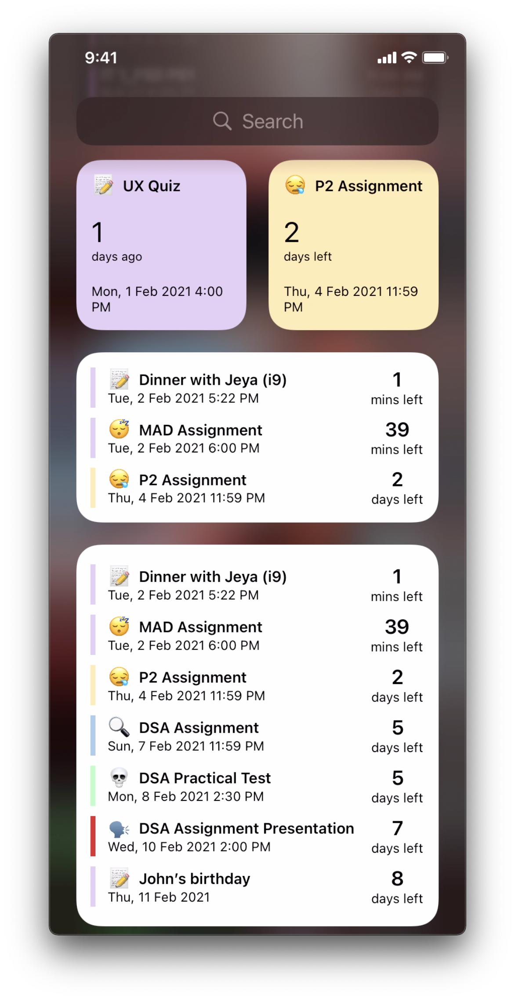

#  Countdown 
<p align="center">
  <p>
  <h3>Introducing Countdown: Supercharge Your Productivity Today!</h3>

  Tired of feeling overwhelmed by your busy schedule? Want to make the most of your time and stay on top of your daily events? Look no further than Countdown, the ultimate productivity app designed to revolutionize the way you track and manage your day-to-day activities.
  
  Countdown is your go-to companion, empowering you to take control of your time and cultivate positive time management habits. With its sleek design and powerful features, it's the ultimate tool for anyone looking to boost their productivity.
  
  Key Features:
  
  1. Effortless Event Management: Create, edit, and delete events with ease. Whether it's a meeting, a deadline, or a special occasion, Countdown keeps you organized and ensures you never miss a beat.
  
  2. Mood-Enhancing Icons: Personalize your events with a range of expressive icons that reflect your mood. Make each countdown uniquely yours and add a touch of personality to your schedule.
  
  3. Customizable Reminders: Stay ahead of your events with timely reminders. Customize notifications to receive alerts 1 hour or 1 day before an event, ensuring you're always prepared and on time.
  
  4. Calendar Overview: Gain a comprehensive view of all your events with the intuitive calendar. Easily navigate through months and stay informed about the number of events you have coming up, helping you plan and prioritize effectively.
  
  5. Interactive Widgets: Transform your home screen into a productivity powerhouse. Countdown offers customizable widgets that provide a quick glance at your events, from a single event view to a convenient list of seven events. Stay organized and focused at a glance.
  
  6. Count Up and Relive Memories: Not just for future events! Countdown allows you to count up from past events, bringing back cherished memories and celebrating milestones. Reflect on your achievements and motivate yourself for even greater success.
  
  7. Real-Time Countdown: Experience the thrill of watching your events unfold in real time. Countdown displays live countdowns, creating a sense of anticipation and excitement as you approach your upcoming events.
  
  8. Cloud Sync: Access your events seamlessly across multiple devices. With cloud synchronization, your events are always up to date, ensuring you never miss a beat, no matter where you are.

  Don't let time slip away. Take charge of your schedule and make every moment count with Countdown. Download now and unlock the key to productivity and success. It's time to supercharge your day with Countdown—the ultimate productivity companion for everyone.

  Make the most of your time. Start counting down to success with Countdown!
  </p>
</p>


## Demo Video
[](https://youtu.be/WeatffbHuSM)

## Screenshots
Home            | Widgets
:-------------------------:|:-------------------------:
  |  

## Built With

- [Firebase Realtime database](https://firebase.google.com/docs/database) - Used for cloud database
- [Firebase Auth](https://firebase.google.com/docs/auth) - Used for user authentication
- [CVCalendar](https://github.com/CVCalendar/CVCalendar) - Used to display events on calendar
- [SideMenu](https://github.com/jonkykong/SideMenu) - Used for side menu profile
- [lottie-ios](https://github.com/airbnb/lottie-ios) - Used for display animation banner
- [NVActivityIndicatorView](https://github.com/ninjaprox/NVActivityIndicatorView) - Used for indicate progress on actions
- [ISEmojiView](https://github.com/isaced/ISEmojiView) - Used for emoji keyboard

## Requirements

- iOS 9.0+
- Xcode 14

## Installation

#### Git clone

```bash
git clone https://github.com/hwennnn/countdown.git
cd countdown
```

#### CocoaPods
Install the pod libraries using [CocoaPods](http://cocoapods.org/):

```ruby
pod install
```

#### Usage

```bash
open countdown.xcworkspace
```

## Credits

<table>
  <tr>
    <td align="center"><a href="https://github.com/hwennnn"><br /><sub><b>Hou Man</b></sub></a><br />
    </td>
        <td align="center"><a href="https://github.com/ZazzyDictionary"><br /><sub><b>Zachary</b></sub></a><br />
    </td>
  </tr>
</table>

## Contribute

We would love you for the contribution to **Countdown**, any issue or pull requrest is welcomed.

