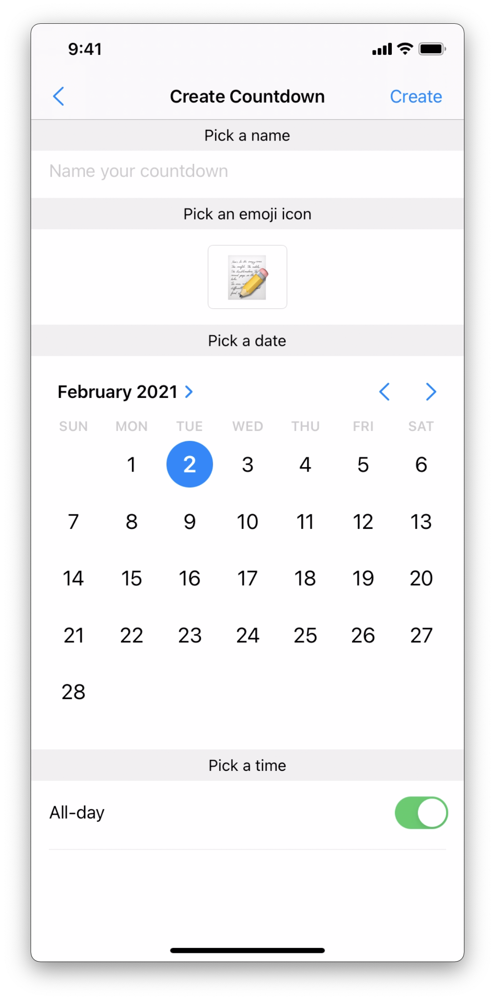
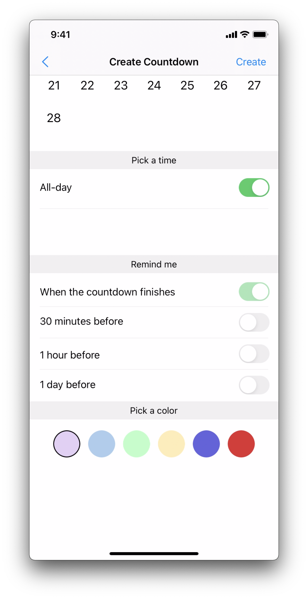

#  Countdown 
<p align="center">
  <p>
      Countdown is a productivity mobile app for keeping track of events in daily life. The app aims to help the users to be more productive by encouraging good         habits of time management.
      The app is targeted to everyone.
      <p>
      Features:
      <br>
        <b>#1.</b> Create, edit and delete events and view them from a calendar or widgets.
      <br>
      <b>#2.</b> Pick any icon you'd like to represent the mood of the countdown.
      <br>
      <b>#3.</b> In addition, to receive notifications about upcoming events, users can customise reminders 1 hour or 1 day before the event.
      <br>
      <b>#4.</b> View all of the events through a calendar, informing them about how many events they have in a month.
      <br>
      <b>#5.</b> Interact with customisable widgets to view the different events from a single view of one event of their choice to a list of 7 events at a glance.
      <br>
      <b>#6.</b> Count up from past events (available on each countdown page).
      <br>
      <b>#7.</b> View the events' countdown in real time
      <br>
      <b>#8.</b> Use the app on different devices as events are synced through the cloud.  
      <br>
      </p>
  </p>
</p>

## Screenshots
<p align="row">
  


  
  
  


    

  
  
</p>

## Built With

- [Firebase Realtime database](https://firebase.google.com/docs/database) - Used for cloud database
- [Firebase Auth](https://firebase.google.com/docs/auth) - Used for user authentication
- [CVCalendar](https://github.com/CVCalendar/CVCalendar) - Used to display events on calendar
- [SideMenu](https://github.com/jonkykong/SideMenu) - Used for side menu profile
- [lottie-ios](https://github.com/airbnb/lottie-ios) - Used for display animation banner
- [NVActivityIndicatorView](https://github.com/ninjaprox/NVActivityIndicatorView) - Used for indicate progress on actions
- [ISEmojiView](https://github.com/isaced/ISEmojiView) - Used for emoji keyboard

## Requirements

- iOS 9.0+
- Xcode 14

## Installation

#### Git clone

```bash
git clone https://github.com/hwennnn/countdown.git
cd countdown
```

#### CocoaPods
Install the pod libraries using [CocoaPods](http://cocoapods.org/):

```ruby
pod install
```

#### Usage

```bash
open .countdown.xcworkspace
```

## Credits

<table>
  <tr>
    <td align="center"><a href="https://github.com/hwennnn"><br /><sub><b>Hou Man</b></sub></a><br />
    </td>
        <td align="center"><a href="https://github.com/ZazzyDictionary"><br /><sub><b>Zachary</b></sub></a><br />
    </td>
  </tr>
</table>

## Contribute

We would love you for the contribution to **Countdown**, any issue or pull requrest is welcomed.

